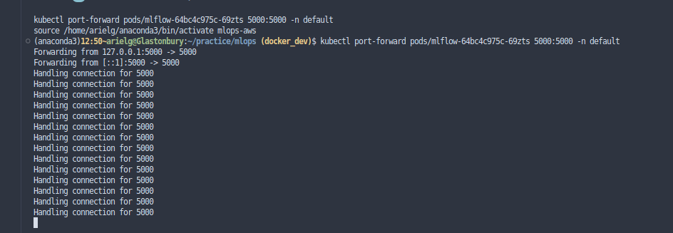
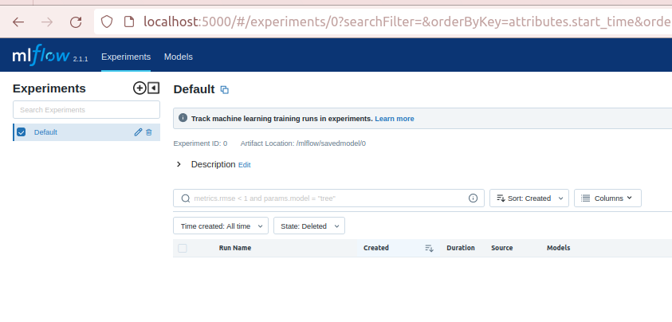

Now that the service and training has been dockerized, its time to get familiar with kubernetes terms and learning to read its declarative yaml syntaxes. This post will be extremely basics, as it goes through the fundamentals of kubernetes, and how I attempt to relate it back to my project.

For simplification, the kubernetes cluster that I deployed is via `minikube`. All functions will be done using `kubectl` as well.

**Services, Deployments, and Pods**

## Persistent volume

I use a cli tool call `Kompose` in attempt to convert my docker compose yaml file to kubernetes automatically. It generates the following yaml files for my docker compose file:

- A series of claim0 - claim2 persistent volume claim yaml file. This yaml file, when applied, claims a specified amount of storage on the cluster. What exactly does it claim, and how does it do that? A `persistent volume` is an individual resource within the cluster, managed by its own Pod. unlike `volume`, which is managed by a specific pod, and will be destroyed when that pod goes down, `persistent volume` stays up all the time. However, they need to be predefined, such as file system, volume, and identifiers.
    - A persistent volume claim yaml file generated for this project to store database would look like this:
        
        ```
        apiVersion: v1
        kind: PersistentVolumeClaim
        metadata:
          creationTimestamp: null
          labels:
            io.kompose.service: mlflow-claim0
          name: mlflow-claim0
        spec:
          accessModes:
            - ReadWriteOnce
          resources:
            requests:
              storage: 100Mi
        status: {}
        ```
        
        Important to make sure `accessModes`  is `ReadWriteOnce` as you do not want multiple services accessing this db at the same time. After applying it, a simple `kubectl describe pvc` returns this:
        
        ```markdown
        Name:          training-claim1
        Namespace:     default
        StorageClass:  standard
        Status:        Bound
        Volume:        pvc-b8478cfb-eba4-4ff5-948b-ce91f4f43ba0
        Labels:        io.kompose.service=training-claim1
        Annotations:   pv.kubernetes.io/bind-completed: yes
                       pv.kubernetes.io/bound-by-controller: yes
                       volume.beta.kubernetes.io/storage-provisioner: k8s.io/minikube-hostpath
                       volume.kubernetes.io/storage-provisioner: k8s.io/minikube-hostpath
        Finalizers:    [kubernetes.io/pvc-protection]
        Capacity:      100Mi
        Access Modes:  RWO
        VolumeMode:    Filesystem
        Used By:       training-7469d6b495-gkn5r
        Events:        <none>
        ```
        
        From first glance, my concerns with db as persistent volumes is that you can’t exactly scale this up since it is declarative. Some of the cloud providers do support dynamically edit file storage size on their pvc. In the case of minikube, it creates a `hostPath` volume (which means it takes a filesystem path from the host and directly link it to a persistent volume on the cluster. It means, according to [this link here](https://platform9.com/blog/tutorial-dynamic-provisioning-of-persistent-storage-in-kubernetes-with-minikube/) that taught me more, if you have a NAS on a IP address on your file system, you’ll be able to attached it onto the cluster.  
        

## Services

A service enables network access to a set of pods. Here is the kubernetes file for the service `mlflow`

```markdown
apiVersion: v1
kind: Service
metadata:
  annotations:
    kompose.cmd: kompose convert
    kompose.version: 1.26.0 (40646f47)
  creationTimestamp: null
  labels:
    io.kompose.service: mlflow
  name: mlflow
spec:
  ports:
    - name: "5000"
      port: 5000
      targetPort: 5000
      nodePort: 5555
  selector:
    io.kompose.service: mlflow
status:
  loadBalancer: {}
```

A rather simple service. The important part that I learned here are the ports:
      `port`: host port

`targetPort`: service port 

     `nodePort`: port on node to be accessed form. Allowing you to access a node directly.

## Deployment

After deploying, it seems to fail to pull image:

```markdown
$ minictl get pods
NAME                                 READY   STATUS             RESTARTS      AGE
mlflow-b7bf49d7c-qjzbt               0/1     ImagePullBackOff   0             25h
terraform-example-75b7f49985-8x2qf   1/1     Running            2 (18h ago)   3d
terraform-example-75b7f49985-vp4pk   1/1     Running            2 (18h ago)   3d
terraform-example-75b7f49985-z44ls   1/1     Running            2 (18h ago)   3d
training-7469d6b495-gkn5r            0/1     ImagePullBackOff   0             25h
```

I used `kubectl describe pods` to get the error further

```markdown
Events:
  Type     Reason          Age                   From     Message
  ----     ------          ----                  ----     -------
  Warning  Failed          19h (x71 over 25h)    kubelet  Failed to pull image "mlflowtraining:latest": 
																							rpc error: code = Unknown 
																							desc = Error response from daemon: 
																							pull access denied for mlflowtraining, 
																							repository does not exist or may require 'docker login': denied: 
																							requested access to the resource is denied
  Normal   Pulling         19h (x72 over 25h)    kubelet  Pulling image "mlflowtraining:latest"
  Normal   BackOff         18h (x1628 over 25h)  kubelet  Back-off pulling image "mlflowtraining:latest"
  Normal   SandboxChanged  31m                   kubelet  Pod sandbox changed, it will be killed and re-created.
  Normal   Pulling         29m (x4 over 31m)     kubelet  Pulling image "mlflowtraining:latest"
  Warning  Failed          29m (x4 over 31m)     kubelet  Failed to pull image "mlflowtraining:latest": rpc error: code = Unknown desc = Error response from daemon: pull access denied for mlflowtraining, repository does not exist or may require 'docker login': denied: requested access to the resource is denied
```

By default, kubernetes pulls image from a registry, by default docker’s registry. We change this by adding `imagePullPolicy: Never` to discourage it from seeking from a registry and assume a local registry. 

I then check if it is running by `minikube kubectl logs mlflow-<podsidhere>` 

```markdown
(mlops-aws)12:50~@:~/practice/mlops (docker_dev)$ minictl logs mlflow-64bc4c975c-69zts
2023/05/08 04:43:13 INFO mlflow.store.db.utils: Creating initial MLflow database tables...
2023/05/08 04:43:13 INFO mlflow.store.db.utils: Updating database tables
INFO  [alembic.runtime.migration] Context impl SQLiteImpl.
INFO  [alembic.runtime.migration] Will assume non-transactional DDL.
INFO  [alembic.runtime.migration] Running upgrade 451aebb31d03 -> 90e64c465722, migrate user column to tags
INFO  [89d4b8295536_create_latest_metrics_table_py] Migration complete!
INFO  [alembic.runtime.migration] Running upgrade 89d4b8295536 -> 2b4d017a5e9b, add model registry tables to db
INFO  [2b4d017a5e9b_add_model_registry_tables_to_db_py] Adding registered_models and model_versions tables to database.
INFO  [2b4d017a5e9b_add_model_registry_tables_to_db_py] Migration complete!
INFO  [alembic.runtime.migration] Running upgrade cc1f77228345 -> 97727af70f4d, Add creation_time and last_update_time to experiments table
INFO  [alembic.runtime.migration] Context impl SQLiteImpl.
INFO  [alembic.runtime.migration] Will assume non-transactional DDL.
[2023-05-08 04:43:18 +0000] [40] [INFO] Starting gunicorn 20.1.0
[2023-05-08 04:43:18 +0000] [40] [INFO] Listening at: http://0.0.0.0:5000 (40)
[2023-05-08 04:43:18 +0000] [40] [INFO] Using worker: sync
[2023-05-08 04:43:18 +0000] [42] [INFO] Booting worker with pid: 42
[2023-05-08 04:43:18 +0000] [43] [INFO] Booting worker with pid: 43
[2023-05-08 04:43:18 +0000] [44] [INFO] Booting worker with pid: 44
[2023-05-08 04:43:18 +0000] [45] [INFO] Booting worker with pid: 45
```

Once it is running, I simply portforward to my host machine’s port 5000:



