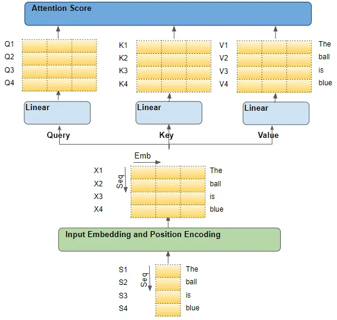

Transformer has been one of the big turning point in Deep learning history, on par with ImageNet, CNN, GAN, and attention modules. I’ve never gotten the opportunity to experiment and deploy them in my previous workplace, so this is a good chance to get myself up to date.

All codes are based off several reference notebooks which are included in the footnotes. All my work are also posted on github here in this link.

 

First, we want to list out some of the most important features of a Transformer setup: 

1. **Positional Encoding**

Unlike RNN, self-attention multi-head module do not posses recurrent networks. How then, do you store sequential order of input within memory? By using positional encoding, it makes sure that the relative positions of the tokens play a role in the output of the model.

In the original transformer paper and notebook, the author proposed an absolute positional encoding based off the derivative of a sin and cosine function.

$$
PE(pos,2i)=sin(pos/100002i/dmodel)

$$

$$
PE(pos,2i+1)=cos(pos/100002i/dmodel)
$$

where `pos` is the position of token in tome and `dmodel`  is the number of dimension of embeddings and i being dimension index of input tensor. [A further explanation on why use both sin and cos function is explained here](https://datascience.stackexchange.com/questions/68553/why-does-the-transformer-positional-encoding-use-both-sine-and-cosine)

In a vision transformer, positional encoding is represented as a learnable parameter. The way this is done is that first an image is broken down into patches, and each row vector represents a patch of `nxn` size. Each patch is then considered as a single position in the positional embeddings.

```python
self.pos_embedding = nn.Parameter(torch.randn(1,1+num_patches, embed_dim))
```

this showcases the initialization of the positional embedding that with the shape `(num_patches+1, embed_dim)`, where `embed_dim` would be 256 for total number of colour values in a single pixel.

*Treating images as tokens in a NLP problem*

One of the first and foremost problem that needs to be solve for transformer to be applicable to 2-dimensional data such as images is representation. In [its original paper of vision transformer](https://arxiv.org/abs/2010.11929), images are broken down into patches of smaller images, and each patch is being treated as a “token”. 

In the vision transformer code, a class embedding token (CLS token) is added prior to the positional embeddings, and is responsible of the final output classification. As to why this was done, the answer was the author admitted that this was only added in order to be consistent with NLP transformers. You may learn more about it from this [stackoverflow question page](https://ai.stackexchange.com/questions/28326/why-class-embedding-token-is-added-to-the-visual-transformer)

```python
# Add CLS token and positional encoding
cls_token = self.cls_token.repeat(B, 1, 1)
# TODO: why concat? isnt it just a sum
x = torch.cat([cls_token, x], dim=1)
x = x + self.pos_embedding[:,:T+1]
```

There has also been attempts to replace cls_token + learnable embeddings with conditional positional encodings with an added global max pooling at the end prior to the MLP module. The paper argues that it has an increase of AP from 33.7 to 33.9. [You may learn more about it here](https://sh-tsang.medium.com/review-cpvt-conditional-positional-encodings-for-vision-transformers-533e5997ec7d)

1. **Self-attention module**

```python

def attention(query, key, value, mask=None, dropout=None):
    # SDPA implementation
    # (Scale Dot-Product Attention)
    d_k = query.size(-1)
    scores = torch.matmul(query, key.Transpose(-2,-1)) \
             / math.sqrt(d_k)
    if mask is not None:
        scores = scores.masked_fill(mask==0,-1e9)
    p_attn = F.softmax(scores, dim=-1)
    if dropout is not None:
        p_attn = dropout(p_attn)
    
    return torch.matmul(p_attn, value), p_attn

class MultiHeadedAttention(nn.Module):
    def __init__(self, h, d_model, dropout=0.1):
        super(MultiHeadedAttention, self).__init__()
        assert d_model % h == 0
        # assume d_v always equals d_k
        self.d_k = d_model // h
        self.h = h
        self.linears = clones(nn.Linear(d_model, d_model), 4)
        self.attn = None
        self.dropout = nn.Dropout(p=dropout)
        
    def forward(self, query, key, value, mask=None):
        if mask is not None:
            mask = mask.unsqueeze(1)
        nbatches = query.size(0)
        
        # 1) Do all linear projectsion in batch
        # d_model => h x d_k
        query, key, value = \
            [l(x).view(nbatches, -1, self.h, self.d_k).transpose(1,2)
             for l,x in zip(self.linears, (query, key, value))]
        
        # 2) Apply attention on all projected vectors in batch
        x, self.attn = attention(query, key, value, mask=mask, 
                                 dropout=self.dropout)
        
        # 3) concat using a view and apply a final linear
        x = x.transpose(1,2).contiguous() \
              .view(nbatches, -1, self.h*self.d_k)
        
        return self.linears[-1](x)
```

The self attention modules are implemented three times across the architecture. The first for capturing the input embeddings (encoder), a second for output embeddings (decoder), and a third for both input and output embeddings (encoder-decoder).

To understand attention module better, it is important to dig deeper into the concept of Query, Key, and Value. Using looking for a youtube video as an analogy, a Q*uery* would be your search string onto the search bar, Youtube will then uses these queries to find for the best matching *Key,* and the results returned will be the *Value. [(a deeper explanation can be found here)](https://towardsdatascience.com/transformers-explained-visually-not-just-how-but-why-they-work-so-well-d840bd61a9d3)*

An implementation of such code is shown as such: 

```python
def attention(query, key, value, mask=None, dropout=None):
    # SDPA implementation
    # (Scale Dot-Product Attention)
    d_k = query.size(-1)
    scores = torch.matmul(query, key.Transpose(-2,-1)) \
             / math.sqrt(d_k)
    if mask is not None:
        scores = scores.masked_fill(mask==0,-1e9)
    p_attn = F.softmax(scores, dim=-1)
    if dropout is not None:
        p_attn = dropout(p_attn)
    
    return torch.matmul(p_attn, value), p_attn
```

How are they represented?



In Input Encoder, the input embeddings and positional encodings are passed to the attention module. Positional Encodings are summed along with input embeddings, and is the sole source for query, key, and value parameters in the attention head, hence called self-attention.

```python
class EncoderLayer(nn.Module):
    def __init__(self, size, self_attn, feed_forward, dropout):
        super(EncoderLayer, self).__init__()
        self.self_attn = self_attn
        self.feed_forward = feed_forward
        self.sublayer = clones(SublayerConnection(size, dropout),2)
        self.size = size
        
    def forward(self, x, mask):
        x = self.sublayer[0](x, lambda x: self.self_attn(x,x,x, mask))
        return self.sublayer[1](x, self.feed_forward)
```

In the Output Encoder, we have two kinds of Attention Module. The first takes in output embedding, and the second takes in output embedding + source embedding as source of its attention calculation. Memory here refers to 

```python
class SublayerConnection(nn.Module):
    """Residual connection followed by layer norm
    """
    def __init__(self, size, dropout):
        super(SublayerConnection, self).__init__()
        self.norm = LayerNorm(size)
        self.dropout = nn.Dropout(dropout)
        
    def forward(self, x, sublayer):
        "Apply residual connection to any sublayer with same size"
        return x + self.dropout(sublayer(self.norm(x)))

class DecoderLayer(nn.Module):
    def __init__(self, size, self_attn, src_attn, feed_forward, dropout):
        super(DecoderLayer, self).__init__()
        self.size = size
        self.self_attn = self_attn
        self.src_attn = src_attn
        self.feed_forward = feed_forward
        self.sublayer = clones(SublayerConnection(size, dropout), 3)
        
    def forward(self, x, memory, src_mask, tgt_mask):
        m = memory
				# first attention module with qkv from the output embed
        x = self.sublayer[0](x, lambda x: self_attn(x,x,x, tgt_mask))
				# second attention module with input result and output result as their source 
        x = self.sublayer[1](x, lambda x: self.src_attn(x,m,m,src_mask))
        
        return self.sublayer[2](x, self.feed_forward)
```


## Masking

The third property we need to learn is Masking. Masking is added onto the output embedding (target vector) to prevent the attention module to overfit itself to the whole target vector.  

```python
def subsequen_mask(size):
    attn_shape = (1, size, size)
    subsequent_mask = np.triu(np.ones(attn_shape), k=1).astype('uint8')
    
    return torch.from_numpy(subsequent_mask) == 0
```